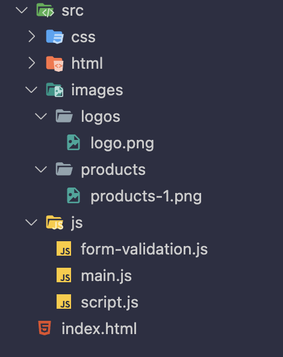

# Convention de nomage générles

Ces présentes conventions ont pour objectif d'harmoniser les noms des fichiers, des fonctions ou classes utilisées au sein des projets web.

## Langue

### La langue employée pour tout texte rédigé au cours d’un projet est le français :

    Les TODO/FIXME
    les titres de commit (versionning),
    les instructions dans le fichier readme.md,
    toute documentation explicative ou technique.

### La langue anglaise demeure préconisée pour :

    L’architecture et les dossiers du projet (assets, layout, components, fonts)
    les commentaires dans un fichier de code,
    Le nom des fichiers (single-something.html, index.js)
    Les branches principales de versionning (main, develop), avec possibilités en français si besoin (recette)

## Union de mots

Les conventions d’usage pour lier les mots sont :

    under_score :
        Fonctions PHP
    kebab-case :
        fichiers pouvant se retrouver dans les URLs (ex : single-something.html)
        classes HTML/CSS
    PascalCase :
        noms de composants dans Vue/Nuxt (ex : ModalAccountMixins.js)
        classes PHP
    camelCase :
        variables et fonctions dans JavaScript (ex : dateFormat, getResellSwitchQty())
        méthodes PHP
    ALL_CAPS (SCREAMING_SNAKE_CASE) :
        constantes

## Synonymes

Si on privilégie l'anglais pour le code et malgré son apparente simplicité, il existe toujours des synonymes.

### Exemple à ne pas reproduire (coexistence de cancel/remove/delete) :

```html
<button class="cancelProduct" onclick="removeProduct(1337)">
  <svg id="remove" ...>
</button>
```

```js
function removeProduct(id) {
  axios.delete("/api/product", id);
}
```

### Suggestions et raisons :

    Ajouter à une liste : add ou append

    Suppression complète de données : delete (car les méthodes REST utilisent DELETE)

    Retirer un élément d'une liste : remove

    Annulation d'action : cancel
    Ouverture/fermeture : open/close (alternativement : toggle)

    Récupération de données : get (existe en tant que méthode HTTP)

    Remplacement de données : set (écrase tout)

    Mise à jour de données : update (similaire à patch, peut remplacer certaines clés d'un objet mais pas toutes)

    Réinitialisation à l'état initial : reset

    Callback/gestionnaire : handle (ex : handleClick)

    Dénombrement : count (ex: pageCount)

    États : is ou has (ex : isOpened, hasItems)

    Précédent/suivant : prev/next

## Nommage pour code en attente

En phase de développement d'un projet, les notes de modifications et améliorations restant à réaliser dans le code (CSS, HTML, JavaScript) doivent être consignées et notées TODO: (et non @TODO) ou FIXME: selon leur fonction :

    TODO: Partie de code non finalisée, non mis en oeuvre (par exemple TODO: implémenter les données, <a href="TODO:">)
    FIXME: Partie de code à améliorer, à modifier pour être plus performant, plus maintenable, etc. (par exemple : FIXME: mieux gérer le responsive, FIXME: refactoring)

### L'extension **VSCode TODO Highlight** perme de mettre en exergue les tags TODO: (en jaune par défaut) et FIXME: (en rose par défaut).

TODO Highlight propose également de lister l'ensemble des tags par fichier via ctrl/cmd + maj + p > List highlighted annotations (liste les tags dans le document en cours).

_En fin de phase de développement, avant la livraison du projet, il est fondamental de vérifier la présence indésirable de ces tags au sein du code. L'idéal étant qu'un projet soit livré sans aucun tag TODO:._

## Nommage des images.

### Utilisez des noms descriptifs

    Nommez vos images de manière à ce qu'elles décrivent leur contenu ou leur fonction. Utilisez des noms significatifs qui reflètent le sujet de l'image. Par exemple, si l'image représente un logo de votre entreprise, vous pourriez l'appeler "logo.png" ou "entreprise-logo.png".

### Utilisez des lettres minuscules

    Utilisez des lettres minuscules pour les noms de fichiers d'images. Comme pour les fichiers HTML, il est préférable de rester cohérent et d'utiliser des minuscules pour éviter toute confusion.

### Utilisez des traits d'union pour les espaces

    Si vous souhaitez séparer les mots dans un nom d'image, utilisez des traits d'union ("-") à la place des espaces. Par exemple, utilisez "background-image.jpg" plutôt que "background image.jpg".

### Utilisez une résolution ou une taille spécifique si nécessaire

    Si vous avez plusieurs versions d'une même image avec des résolutions différentes, vous pouvez ajouter une indication de la résolution dans le nom du fichier. Par exemple, "logo-200x200.png" pour une version de 200 pixels sur 200 pixels du logo.

### Suivez une structure cohérente

    Si votre site utilise une structure de dossiers pour organiser les images, essayez de suivre une convention de nommage cohérente à l'intérieur de ces dossiers. Par exemple, vous pouvez avoir un dossier "images" contenant des sous-dossiers pour les différentes catégories d'images, tels que "logos", "bannières" ou "produits".

Voici un exemple de structure de dossiers avec cette conventio

- images/
  - logos/
    - logo.png
    - logo-200x200.png
  - banners/
    - banner-1.jpg
    - banner-2.jpg
  - products/
    - product1.jpg
    - product2.jpg

## Nommage des fichiers

### Utilisez des noms descriptifs

    Nommez vos fichiers HTML de manière à ce qu'ils décrivent leur contenu ou leur fonction. Utilisez des noms significatifs qui reflètent le but du fichier. Par exemple, si le fichier contient la page d'accueil de votre site, vous pourriez l'appeler "index.html".

### Utilisez des lettres minuscules

    Utilisez des lettres minuscules pour les noms de fichiers HTML. Les systèmes de fichiers peuvent être sensibles à la casse, il est donc préférable de rester cohérent et d'utiliser des minuscules pour éviter toute confusion.

### Utilisez des traits d'union pour les espaces

    Si vous souhaitez séparer les mots dans un nom de fichier, utilisez des traits d'union ("-") à la place des espaces. Par exemple, utilisez "about-us.html" plutôt que "about us.html".

### Utilisez l'extension ".html"

    Pour indiquer que le fichier est un fichier HTML, utilisez l'extension ".html" à la fin du nom de fichier. Cela aide à identifier facilement les fichiers HTML parmi d'autres types de fichiers.

### Suivez une structure cohérente

    Si votre site utilise une structure de dossiers, essayez de suivre une convention de nommage cohérente pour les fichiers HTML à l'intérieur de ces dossiers. Par exemple, vous pourriez utiliser un préfixe ou un suffixe pour indiquer la fonction du fichier, comme "contact.html" pour la page de contact et "blog-post-1.html" pour le premier article de blog.

Voici un exemple de structure de fichiers avec cette convention de nommage :

- index.html
- src 
    - html/  
        - about-us.html
        - services.html
        - contact.html
    - css/
        - styles.css
    - js/
        - script.js
    - images/
        - logo.png
        - background.jpg
I




## Nommage du versionning 

### Utilisez des minuscules 

    Utilisez des lettres minuscules pour les noms des versions. 

### Utilisez des traits d'union pour les noms composés 

    Si vous avez besoin d'utiliser des noms composés pour vos versions, utilisez des traits d'union pour les séparer. Par exemple, 

    header-searchbar-v1

### Faire des versions hiéarchisées 

    Les versions "v1", "v1.1" et "v1.1.1" peuvent être généralement appelées de la manière suivante :

    "v1" est généralement appelée la version majeure initiale ou la première version majeure d'un projet. Cela représente souvent une version de base avec des fonctionnalités essentielles.
    
    "v1.1" est considérée comme une version mineure de la "v1". Elle peut inclure des ajouts de fonctionnalités, des améliorations ou des corrections de bugs sans introduire de changements majeurs qui seraient incompatibles avec la version "v1".
    
    "v1.1.1" est une version de correctif (patch) pour la "v1.1". Elle indique qu'il y a eu des corrections de bugs spécifiques ou des ajustements mineurs, sans introduire de nouvelles fonctionnalités significatives.

### Faire une description 

    Faire une description résumée du code intégré ainsi que les potentielles modifications à ajouter 