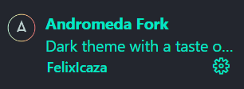

# Projet : Développement d'un site de formation en ligne

## Plateau technique du projet

### Logiciels de développement

- [Figma](https://help.figma.com/hc/fr) pour la conception des maquettes du sites internet
- [Canva](https://www.canva.com/fr_fr/help/about-canva-docs/)
- [VSCodium v1.78.2.23132](https://vscodium.com/) pour coder le site internet;
- [Git v2.40.1 ](https://docs.github.com/fr) Pour la collaboration est la gestion du projet.

### Langage de programmation

- [HTML5](https://developer.mozilla.org/en-US/docs/Web/HTML) pour édité et structuré les pages web.
- [CSS3](https://developer.mozilla.org/fr/docs/Web/CSS/Reference) Pour géré l'apparence et la mise en forme de les pages web.
- [PHP8.2](https://www.php.net/releases/8.2/fr.php) pour la partie dynamique du site web.
- [Java Script](https://developer.mozilla.org/fr/docs/Web/JavaScript) pour la gestion des animations de certain aspect du site.

### Frameworks et bibliothèques

#### CSS

- [Boostrap v5.3](https://getbootstrap.com/docs/5.3/getting-started/introduction/) pour faciliter la création d'interfaces web et allégé le code
- [SASS](https://zestedesavoir.com/tutoriels/pdf/672/reprenez-le-controle-de-vos-feuilles-de-style-avec-sass.pdf)

#### Java script

- [WEBPACK](https://webpack.js.org/)
- [BABEL](https://babeljs.io/docs)

#### Base de donnee

- [MYSQL](https://dev.mysql.com/doc/) Pour la gestion de la base de donnée du site.

### Navigateur Web

- [Google Chrome](https://developer.chrome.com/docs/)
- [Mozilla Firfox](https://developer.mozilla.org/fr/docs/Mozilla/Firefox)
- [Microsoft Edge](https://learn.microsoft.com/fr-fr/microsoft-edge/)

- Opera

- Safari

### Extension

- [Andromeda Fork](https://open-vsx.org/vscode/item?itemName=FelixIcaza.andromeda) Pour choisir un theme sur codium.

- [Bracket Pair Colorier 2 v0.1.4](https://open-vsx.org/vscode/item?itemName=CoenraadS.bracket-pair-colorizer)
  attribue des couleurs différentes aux paires de parenthèses, crochets et accolades dans votre code.

- [Composer v134.13120](https://open-vsx.org/vscode/item?itemName=devsense.composer-php-vscode) facilite l'utilisation de Composer en offrant des fonctionnalités telles que la complétion automatique, la validation de la configuration et la gestion des dépendances. Ca permet aux de gérer facilement les bibliothèques et les packages nécessaires pour le projet

- [Live Server v0.2.3](https://open-vsx.org/vscode/item?itemName=yandeu.five-server) permet de visualiser en direct les modifications apportées à un fichier HTML, CSS ou JavaScript.

- Live Share

- [Material Icon theme v4.27.0](https://open-vsx.org/vscode/item?itemName=PKief.material-icon-theme)remplace les icônes par défaut des fichiers et des dossiers par des icônes basées sur le style Material Design de Google.

- [PHP v1.34.13120](https://open-vsx.org/vscode/item?itemName=devsense.phptools-vscode) fournit des fonctionnalités spécifiques à PHP pour faciliter le développement dans cet environnement comme la coloration syntaxique, la validation du code, l'autocomplétion...

- [Boostrap5 v1.2.5](https://open-vsx.org/vscode/item?itemName=HansUXdev.bootstrap5-snippets) (si pas installé)Pour facilité la conception et le développement en fournissant un ensemble de styles pré-définis, de composants réutilisables et de fonctionnalités JavaScript intégrées, fournit des classes et composants pour styliser et structurer rapidement le code HTML.

- [CodeTogether](https://open-vsx.org/vscode/item?itemName=genuitecllc.codetogether) permet le développement avec d'autres utilisateurs, ce qui permet de visualiser et de modifier le code simultanément.

### Ressources

- [Trello "User Story Utilisateur"](https://trello.com/b/7bekV79g/user-story-utilisateur)

- [Brandboard](https://trello.com/c/RZmSSTdw/2-brandboard)

- Benchmark

- Personnas

- Convention de nommage

- user story

- cahier des charges (questionnaire...)
